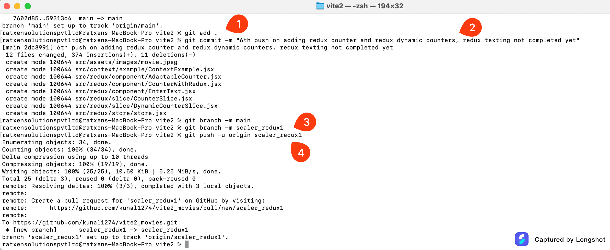
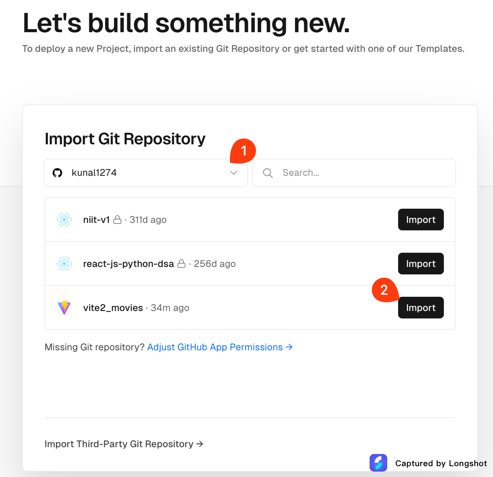

# React + Vite

This template provides a minimal setup to get React working in Vite with HMR and some ESLint rules.

Currently, two official plugins are available:

- [@vitejs/plugin-react](https://github.com/vitejs/vite-plugin-react/blob/main/packages/plugin-react/README.md) uses [Babel](https://babeljs.io/) for Fast Refresh
- [@vitejs/plugin-react-swc](https://github.com/vitejs/vite-plugin-react-swc) uses [SWC](https://swc.rs/) for Fast Refresh

### How to push the code to git hub repository through CLI only 

#### How to create the personal tokens in github 

#### how to push new code changes to git hub 

#### how to create new branch direclty from the terminal 

## Vercel + Vite 
##### Vercel Environment variable

### How to configure Vercel
- Create the project 

- - importing the required repository ( initially it will be tagged to main branch)

